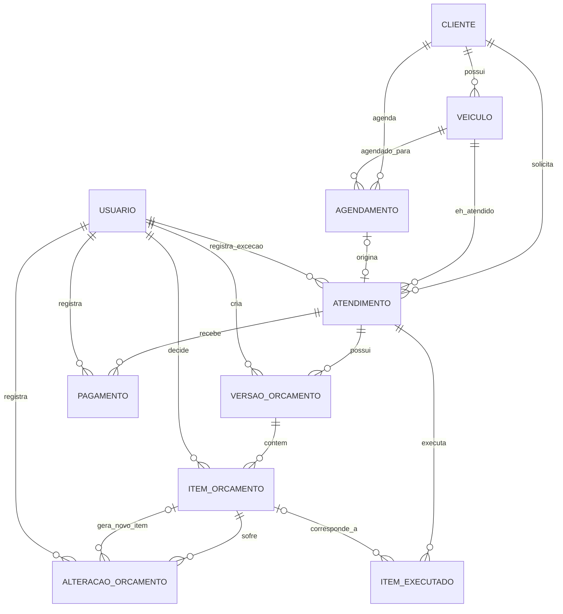

# Modelo de dados — Sistema da Oficina

Versão revisada 2: incorpora as correções identificadas ao comparar o modelo
com o contrato da API (decisão do cliente movida para o item do orçamento,
nomenclatura de perfil alinhada ao contrato, idempotência de pagamento e
concorrência de agendamento).

## 1. Diagrama conceitual

## 2. O que mudou nesta revisão (motivado pelo contrato da API)

| Mudança | Motivo |
|---|---|
| `item_orcamento` ganha `decidido_por_usuario_id` e `decidido_em` | o contrato decide por **item** (`POST /estimates/{id}/decisions` recebe `itemId`), não por alteração; a decisão precisa ser rastreável no item, cobrindo tanto o item original quanto o item que nasce de uma alteração |
| `alteracao_orcamento` perde `decisao_status` e `decisao_em` | evita duas fontes de verdade para a mesma decisão — ela passa a viver sempre em `item_orcamento` (no item original ou no `novo_item_orcamento_id`) |
| `usuario.perfil` passa de `enum(DONO, ZECA)` para `enum(OWNER, MECHANIC)` | alinhar com os valores de `role` já usados no contrato da API (seção 3 e 25 do contrato) |
| `pagamento` ganha `idempotency_key` | evita pagamento duplicado quando o frontend reenvia uma requisição que demorou (seção 31 do contrato) |
| `agendamento` ganha `versao` (lock otimista) | permite ao backend detectar e rejeitar com `409 Conflict` quando dono e mecânico alteram o mesmo horário ao mesmo tempo (seção 30, R14/R15 do contrato) |

## 3. Dicionário de dados

### USUARIO
| Campo | Tipo | PK | FK | Null | Unique | Descrição |
|---|---|---|---|---|---|---|
| id | uuid | ✔ | | não | | identificador |
| login | varchar(60) | | | não | ✔ | login de acesso |
| senha | varchar(255) | | | não | | hash da senha |
| perfil | enum(OWNER, MECHANIC) | | | não | | controla autorização |

### CLIENTE
| Campo | Tipo | PK | FK | Null | Unique | Descrição |
|---|---|---|---|---|---|---|
| id | uuid | ✔ | | não | | identificador |
| nome | varchar(120) | | | não | | nome do cliente |
| telefone | varchar(20) | | | não | | contato principal |

### VEICULO
| Campo | Tipo | PK | FK | Null | Unique | Descrição |
|---|---|---|---|---|---|---|
| id | uuid | ✔ | | não | | identificador |
| cliente_id | uuid | | ✔ CLIENTE | não | | dono do veículo |
| modelo | varchar(80) | | | sim | | modelo do veículo |
| cor | varchar(30) | | | sim | | cor |
| placa | varchar(10) | | | sim | ✔ | placa (quando cadastrada) |
| ano | int | | | sim | | ano, informado quando necessário |
| km | bigint | | | sim | | quilometragem, relevante p/ ex. troca de óleo |

### AGENDAMENTO
| Campo | Tipo | PK | FK | Null | Unique | Descrição |
|---|---|---|---|---|---|---|
| id | uuid | ✔ | | não | | identificador |
| cliente_id | uuid | | ✔ CLIENTE | não | | cliente que agendou |
| veiculo_id | uuid | | ✔ VEICULO | não | | veículo agendado |
| data_hora | datetime | | | não | | data/hora do agendamento |
| status | enum(AGENDADO, CANCELADO, NAO_COMPARECEU) | | | não | | situação atual |
| versao | int | | | não (default 1) | | lock otimista; incrementa a cada update, usado para responder 409 em edição concorrente |

### ATENDIMENTO
| Campo | Tipo | PK | FK | Null | Unique | Descrição |
|---|---|---|---|---|---|---|
| id | uuid | ✔ | | não | | identificador |
| cliente_id | uuid | | ✔ CLIENTE | não | | responsável pelo atendimento |
| veiculo_id | uuid | | ✔ VEICULO | não | | veículo atendido |
| agendamento_id | uuid | | ✔ AGENDAMENTO | sim | | origem, quando existir |
| problema_relatado | text | | | sim | | relato do cliente |
| avaliacao | text | | | sim | | avaliação inicial |
| diagnostico | text | | | sim | | diagnóstico técnico |
| status | enum(EM_AVALIACAO, AGUARDANDO_APROVACAO, EM_EXECUCAO, ENCERRADO, CANCELADO) | | | não | | fase atual |
| execucao_inicio | datetime | | | sim | | início efetivo do serviço |
| execucao_fim | datetime | | | sim | | encerramento efetivo |
| execucao_interrompida | boolean | | | não (default false) | | houve interrupção (ex.: recusa pós-desmontagem) |
| execucao_obs | text | | | sim | | observação livre da interrupção |
| entrega_data | datetime | | | sim | | data/hora da entrega |
| entrega_excecao | boolean | | | não (default false) | | entrega liberada por exceção manual |
| entrega_excecao_obs | text | | | sim | | motivo da exceção |
| entrega_excecao_usuario_id | uuid | | ✔ USUARIO | sim | | quem autorizou a exceção |

### VERSAO_ORCAMENTO
| Campo | Tipo | PK | FK | Null | Unique | Descrição |
|---|---|---|---|---|---|---|
| id | uuid | ✔ | | não | | identificador |
| atendimento_id | uuid | | ✔ ATENDIMENTO | não | | atendimento dono do orçamento |
| numero_versao | int | | | não | | sequência (1, 2, 3…); a versão vigente é a de maior número |
| criado_em | datetime | | | não | | data de criação da versão |
| criado_por_usuario_id | uuid | | ✔ USUARIO | não | | quem gerou a versão |

### ITEM_ORCAMENTO
| Campo | Tipo | PK | FK | Null | Unique | Descrição |
|---|---|---|---|---|---|---|
| id | uuid | ✔ | | não | | identificador |
| versao_orcamento_id | uuid | | ✔ VERSAO_ORCAMENTO | não | | versão a que pertence |
| tipo | enum(SERVICO, PECA) | | | não | | natureza do item |
| descricao | varchar(160) | | | não | | descrição do item |
| valor | decimal(10,2) | | | não | | valor orçado |
| status_aprovacao | enum(PENDENTE, APROVADO, RECUSADO) | | | não (default PENDENTE) | | decisão do cliente sobre este item |
| decidido_por_usuario_id | uuid | | ✔ USUARIO | sim | | usuário da oficina que **registrou** a decisão (não é quem decidiu — quem decide é o cliente) |
| decidido_em | datetime | | | sim | | data/hora em que a decisão foi registrada |

### ALTERACAO_ORCAMENTO
| Campo | Tipo | PK | FK | Null | Unique | Descrição |
|---|---|---|---|---|---|---|
| id | uuid | ✔ | | não | | identificador |
| item_orcamento_id | uuid | | ✔ ITEM_ORCAMENTO | não | | item original afetado |
| novo_item_orcamento_id | uuid | | ✔ ITEM_ORCAMENTO | sim | | item resultante na nova versão — é nele que a decisão da alteração fica registrada (`status_aprovacao`/`decidido_por_usuario_id`/`decidido_em`) |
| valor_anterior | decimal(10,2) | | | não | | valor antes da alteração |
| valor_novo | decimal(10,2) | | | não | | valor proposto |
| motivo | varchar(255) | | | sim | | motivo da alteração |
| usuario_id | uuid | | ✔ USUARIO | não | | quem registrou a alteração |
| criado_em | datetime | | | não | | data/hora do registro |

### ITEM_EXECUTADO
| Campo | Tipo | PK | FK | Null | Unique | Descrição |
|---|---|---|---|---|---|---|
| id | uuid | ✔ | | não | | identificador |
| atendimento_id | uuid | | ✔ ATENDIMENTO | não | | atendimento a que pertence |
| item_orcamento_id | uuid | | ✔ ITEM_ORCAMENTO | sim | | item orçado correspondente, quando houver |
| tipo | enum(SERVICO, PECA) | | | não | | natureza do item |
| descricao | varchar(160) | | | não | | descrição do que foi feito/usado |
| valor_cobrado | decimal(10,2) | | | não | | valor cobrado do cliente |
| custo_oficina | decimal(10,2) | | | sim (só quando tipo = PECA) | | custo de compra da peça |

### PAGAMENTO
| Campo | Tipo | PK | FK | Null | Unique | Descrição |
|---|---|---|---|---|---|---|
| id | uuid | ✔ | | não | | identificador |
| atendimento_id | uuid | | ✔ ATENDIMENTO | não | | atendimento pago |
| valor | decimal(10,2) | | | não | | valor do pagamento |
| forma_pagamento | enum(DINHEIRO, PIX, DEBITO, CREDITO) | | | não | | forma escolhida |
| data | datetime | | | não | | data/hora do pagamento |
| usuario_id | uuid | | ✔ USUARIO | não | | quem registrou |
| status | enum(CONFIRMADO, CANCELADO) | | | não (default CONFIRMADO) | | permite cancelamento sem apagar o registro |
| idempotency_key | varchar(64) | | | sim | ✔ | chave enviada pelo frontend; se já existir, a API retorna o pagamento já criado em vez de duplicar |

## 4. Constraints sugeridas

- Todas as FKs com `ON DELETE RESTRICT` (nada relevante deve sumir com um DELETE, conforme item 30 do briefing do banco).
- `veiculo.placa` única quando informada (`UNIQUE` parcial, aceitando múltiplos `NULL`).
- `usuario.login` único.
- `pagamento.valor > 0`.
- `pagamento.idempotency_key` única quando não nula.
- `item_orcamento.valor >= 0`.
- `item_executado.valor_cobrado >= 0` e `item_executado.custo_oficina >= 0` quando não nulo.
- `check` em `item_executado`: `custo_oficina` só pode ser preenchido quando `tipo = 'PECA'`.
- `check` em `item_orcamento`: `decidido_por_usuario_id`/`decidido_em` só podem estar preenchidos quando `status_aprovacao <> 'PENDENTE'`.
- `alteracao_orcamento.valor_anterior <> alteracao_orcamento.valor_novo` (não registrar alteração sem mudança real).
- `agendamento.status`, `atendimento.status`, `item_orcamento.status_aprovacao`, `pagamento.forma_pagamento`, `pagamento.status`, `usuario.perfil` como `enum`/`check` restrito aos valores válidos.
- `atendimento.agendamento_id` único quando não nulo (garante a cardinalidade 0..1–0..1 com `AGENDAMENTO`).
- Update em `agendamento` deve incluir `WHERE versao = :versao_lida` e incrementar `versao`; 0 linhas afetadas ⇒ o backend responde `409 Conflict`.

## 5. Índices sugeridos

| Tabela | Índice | Motivo |
|---|---|---|
| cliente | telefone | busca de cliente por telefone |
| veiculo | placa | busca por placa |
| veiculo | cliente_id | listar veículos de um cliente |
| agendamento | (data_hora) | consulta de agenda por data |
| agendamento | (veiculo_id, data_hora) | checagem de conflito de horário |
| atendimento | cliente_id | histórico de atendimentos por cliente |
| atendimento | veiculo_id | histórico por veículo |
| atendimento | status | fila de atendimentos em aberto |
| versao_orcamento | atendimento_id | montar histórico de versões |
| item_orcamento | versao_orcamento_id | montar itens de uma versão |
| alteracao_orcamento | item_orcamento_id | histórico de alterações de um item |
| item_executado | atendimento_id | montar valor final de um atendimento |
| pagamento | atendimento_id | somar pagamentos / calcular saldo |
| pagamento | data | fechamento de caixa diário |
| pagamento | idempotency_key | detectar reenvio de requisição |

## 6. Normalização

O modelo está em 3FN: cada tabela representa uma única entidade, sem dados
derivados armazenados. Duas decisões intencionais de desnormalização/cálculo:

- **Valor final** e **saldo** não são colunas — são calculados por consulta
  (`SUM(item_executado.valor_cobrado)` e `valor_final - SUM(pagamento.valor)`).
  Armazenar esses valores exigiria mantê-los sincronizados toda vez que um
  item executado ou pagamento mudasse, o que é exatamente o tipo de
  sobrescrita que o briefing pede para evitar.
- **Caixa diário** não é tabela — é uma consulta agregada sobre `pagamento`
  agrupada por data e forma de pagamento.

## 7. Histórico e versionamento

- Cada alteração de orçamento gera uma nova `versao_orcamento`, com os itens
  da versão anterior copiados para `item_orcamento` (mesmo os que não
  mudaram) — a versão antiga nunca é editada.
- `alteracao_orcamento` conecta o item antigo (`item_orcamento_id`) ao item
  novo (`novo_item_orcamento_id`), preservando valor anterior, valor novo,
  motivo e quem registrou. A decisão do cliente sobre essa alteração fica no
  próprio item novo (`item_orcamento.status_aprovacao` /
  `decidido_por_usuario_id` / `decidido_em`), a mesma estrutura usada para a
  aprovação inicial — um único lugar para consultar "o que foi decidido e
  quem registrou", em vez de duas.
- Isso permite reconstruir a cadeia completa pedida no cenário 13 do
  briefing do banco e no cenário 11 do contrato da API:
  `versao_orcamento` (o que foi orçado) → `alteracao_orcamento` (o que
  mudou) → `item_orcamento.status_aprovacao` (o que foi decidido) →
  `item_executado` (o que foi feito) → `pagamento` (o que foi pago).
- Nenhuma tabela histórica usa `DELETE`: cancelamentos e recusas são
  representados por `status`/`status_aprovacao`, nunca por remoção de linha.

## 8. Pontos de decisão

1. **Conflito de agendamento** — assumido: duração padrão configurável por
   tipo de serviço (ex.: 60 min quando não especificado) e capacidade única
   simultânea. A checagem de sobreposição usa `(veiculo_id, data_hora)` mais
   a janela de duração — a regra de duração em si precisa ser confirmada.
2. **`atendimento.status`** — adotados `EM_AVALIACAO`,
   `AGUARDANDO_APROVACAO`, `EM_EXECUCAO`, `ENCERRADO`, `CANCELADO`.
3. **Bloqueio de entrega** — não existe coluna de status de entrega
   bloqueada; o bloqueio é sempre calculado (`saldo > 0`) no momento da
   consulta, e a liberação por exceção fica registrada nos campos
   `entrega_excecao*` de `atendimento`.
4. **Estratégia de idempotência** — usei uma chave única enviada pelo
   frontend (`idempotency_key`). Alternativa possível: o backend gerar um
   token na criação do rascunho de pagamento e o frontend reenviar esse
   token — qualquer uma resolve o problema descrito na seção 31 do
   contrato, mas a escolha final de formato/geração da chave fica com o
   time de backend.
